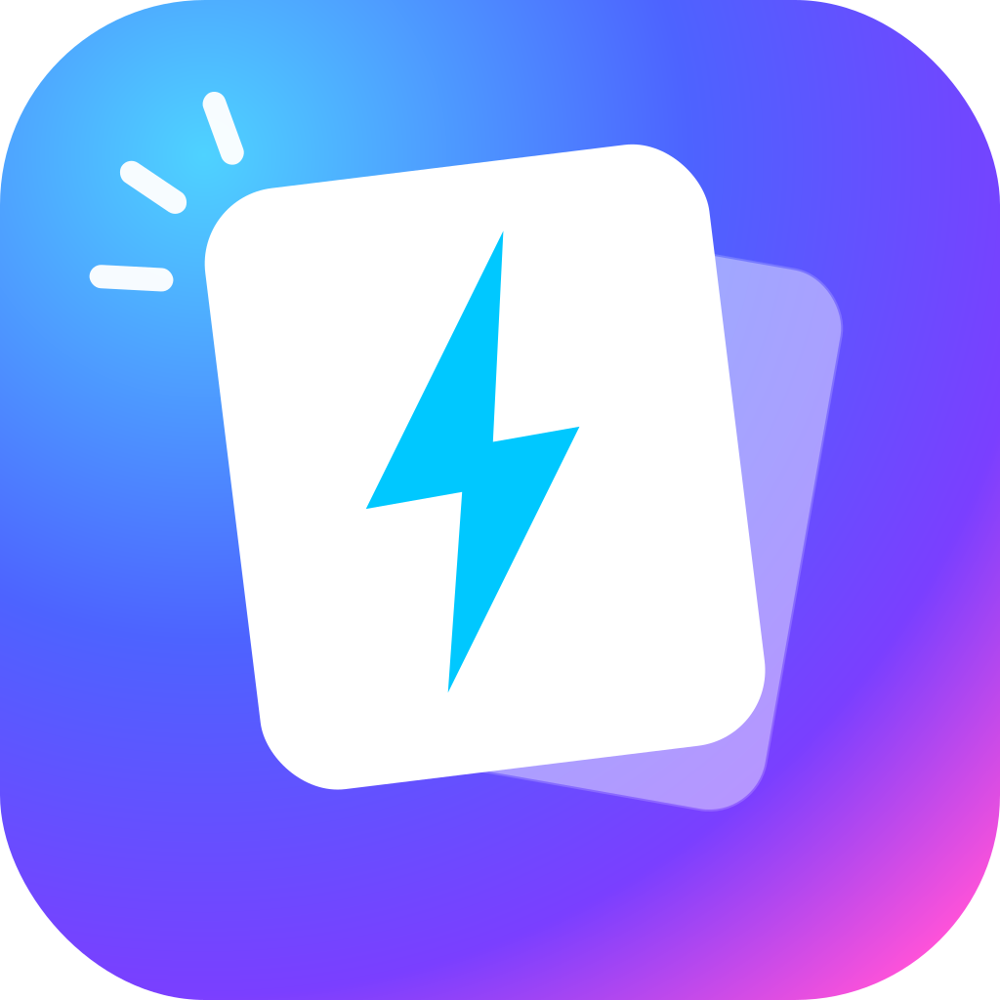
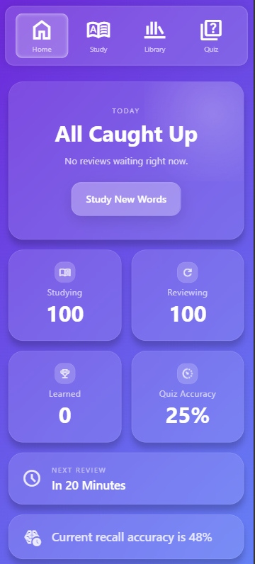
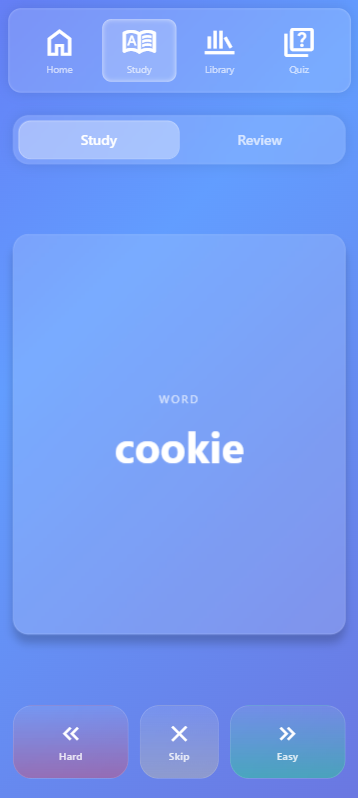
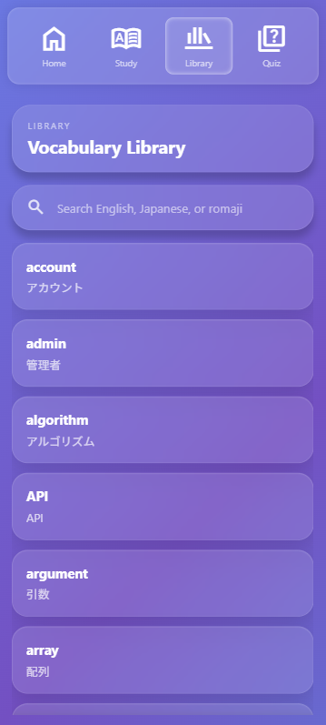
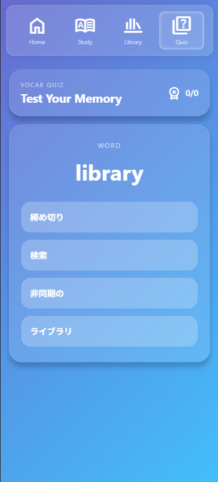

	

<h1 align="center">VFlash</h1>

A lightweight English to Japanese vocabulary learning application focused on fast reviews, active recall, and simple study sessions.

 

---

## Overview

VFlash is a browser-based vocabulary learning application built with:

- HTML
- CSS
- JavaScript
- jQuery
- Bootstrap

The project focuses on:

- Flashcard learning
- Review scheduling
- Recall tracking
- Quiz practice
- Vocabulary library browsing

The application stores all progress locally using `localStorage`.

 

---

## Project Notes

- ### This project was designed primarily for mobile devices. Desktop responsiveness has not been fully implemented yet.
- ### It is highly recommended to open the app on:
  - a mobile device
  - or desktop browser mobile view / responsive mode

 

---
---

 

## Features

### Dashboard

- Review readiness
- Studying count
- Learned vocabulary count
- Quiz accuracy
- Upcoming review timer
- Recall accuracy
- Motivation system

 

### Study System

- Flashcard-based learning
- Front/back card flipping
- Easy / Hard / Skip actions
- Automatic queue generation
- Dynamic review scheduling

 

### Review System

- Spaced repetition inspired scheduling
- Review queue based on due time
- Recall tracking from review performance

 

### Quiz System

- Multiple-choice vocabulary quiz
- Uses saved vocabulary progress
- Tracks quiz accuracy
- Integrated into recall metrics

 

### Vocabulary Library

- Search vocabulary instantly
- View studied words first
- Detailed word information view
- Mastery level display
- Review timing information

 

---

 

## Data Disclaimer

The vocabulary dataset included in this project is for demonstration purposes only.

- Accuracy is not guaranteed
- Example sentences may contain mistakes
- Japanese translations may not always be natural
- Vocabulary balancing is incomplete

This project is intended as a learning/demo application.

 

---

## Local Storage

The application stores:

- Vocabulary progress
- Review schedules
- Recall metrics
- Quiz performance

using browser `localStorage`.

No backend or database is currently used.

 

---

## Current Limitations

- No cloud sync
- No account system
- No desktop optimization
- No audio pronunciation
- No advanced spaced repetition algorithm
- Demo vocabulary dataset only

 

---

## Future Ideas

Possible future improvements:

- Better spaced repetition algorithm
- Online based user system
- Kanji difficulty filtering
- Vocabulary tagging
- Audio support
- Offline PWA support
- Daily streak system
- Adaptive quizzes
- Statistics improvements
- Theme customization

 

### Running Locally

Simply open:
	
	index.html
in a browser.

Or use a local development server.
 

### License

This project is currently for educational and portfolio purposes.

---

## Screenshots

